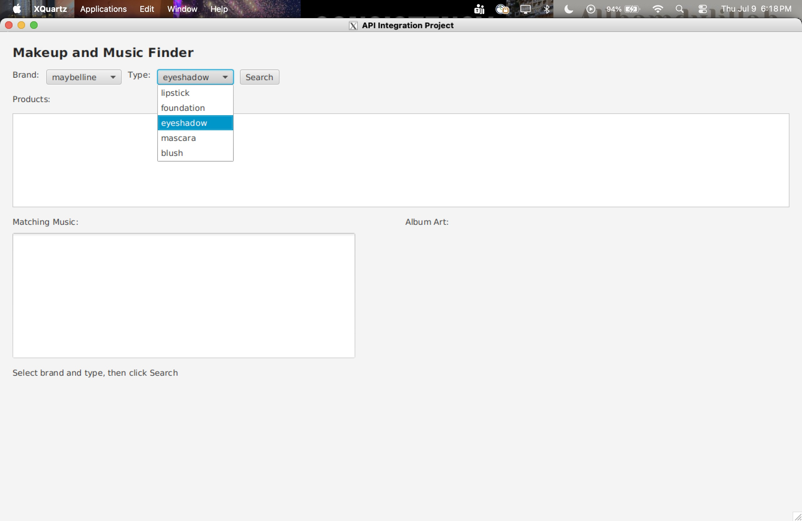

# 💄 Makeup & Music Finder



A JavaFX desktop application that integrates the Makeup API and iTunes Search API to generate music recommendations based on user-selected makeup products.

---

## Overview

Makeup & Music Finder is a desktop application built with JavaFX that combines two public REST APIs to create a unique user experience. Users search for makeup products by brand and product type, then receive music recommendations based on the selected product.

This project demonstrates object-oriented programming, REST API integration, JSON parsing with Gson, asynchronous programming, and desktop application development using Java.

---

## Features

- Search makeup products by brand and product type
- Retrieve live product data from the Makeup API
- Generate music recommendations using the iTunes Search API
- Display song title, artist, album, and album artwork
- Maintain a responsive user interface using background threads
- Parse live JSON responses using Gson

---

## Application Preview

### Home Screen


### Product Search


### Music Recommendations


---

## Technologies

- Java 17
- JavaFX
- Java HttpClient
- RESTful APIs
- Gson
- Maven
- Git & GitHub

---

## Technical Skills Demonstrated

- Object-Oriented Programming
- REST API Integration
- JSON Parsing
- JavaFX UI Development
- Multithreading
- HTTP Requests
- API Response Processing

---

## APIs Used

### Makeup API

Used to retrieve makeup products based on a selected brand and product type.

### iTunes Search API

Used to generate music recommendations using keywords extracted from the selected makeup product.

---

## How It Works

1. Select a makeup brand.
2. Select a makeup product type.
3. Retrieve matching products using the Makeup API.
4. Select a product from the results.
5. Search the iTunes API using the selected product name.
6. Display matching songs, artists, albums, and album artwork.

---

## Project Workflow

```text
User
   │
   ▼
Select Brand & Product Type
   │
   ▼
Makeup API
   │
   ▼
Display Matching Products
   │
   ▼
User Selects Product
   │
   ▼
iTunes Search API
   │
   ▼
Display Songs + Album Artwork
```

---

## Challenges

One challenge was integrating two unrelated REST APIs into a single workflow. The application retrieves makeup products from one API, extracts keywords from the selected product, and then searches a second API to generate relevant music recommendations while maintaining a responsive user interface.

---

## What I Learned

- Consuming REST APIs using Java HttpClient
- Parsing JSON data with Gson
- Building JavaFX desktop applications
- Managing background threads with Platform.runLater()
- Structuring applications using object-oriented programming
- Designing responsive user interfaces

---

## Future Improvements

- Improve error handling for failed API requests
- Add product filtering and sorting options
- Save favorite products and songs
- Support additional makeup brands and product categories
- Integrate Spotify for expanded music recommendations
- Enhance the user interface with custom styling

---

## Running the Application

Clone the repository:

```bash
git clone https://github.com/raynarobinson/Music-Inspired-Makeup-Recommendation-App.git
```

Navigate to the project directory:

```bash
cd Music-Inspired-Makeup-Recommendation-App
```

Run the application:

```bash
./run.sh
```

---

## Author

**Rayna Robinson**

University of Georgia  
B.S. Computer Science
